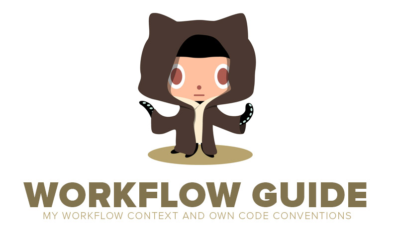

> This is a work in progress and I will likely add (or replace) more functionality in the future.

# Introduction

Hello there! I'm Vitor Britto, a Full Stack Developer extremely passionate about my work. I discovered the world of code almost two decades ago and kept the same passion from the first day of this discovery. I have worked full time as a freelancer for nearly 4 years developing projects for the web, and I direct part of my time to researchs, collaborative projects, development of personal projects and writing some articles for my blog.

But enough about me! I would like to present this project and why it was created.

**First reason:**

Apply rules and be based on a principle and methodology of process which could maintain the structure of my standards.

**Second reason:**

Not only have a code style guide, but relevant informations about my Workflow. Thus I always keep the same logic process and can initiate the development of my projects without any questions when making a scaffolding, building process, automation rotines, unit testing and others tasks.

**This guide consists in four parts:** :ghost:

1. My workflow context with approaches and methods that I use.
2. Tools that makes my Workflow easy.
3. My own code conventions, which is inspired by what is popular within the community and flavored with some personal opinions.
4. Major dependencies that I use.

> In the last projects, Grunt shows some unstable performance in my Wofklow. I'm not saying that grunt is worse than Gulp. No! Unfortunately, it doesn't fits on my workflow anymore.
> I've been working a lot with ~~Isomorphic Applications using JavaScript both on client and server-side~~ Universal JavaScript Applications. Gulp, is programmatically closer to NodeJS. I love the pipe flow at Gulp. It reminds me the UNIX System :heart:.

# Table of Contents

- [Candidate Tools](#candidate-tools)
- [Workflow](#workflow)

  - [Strategy and Management](#strategy-and-management)
  - [Blueprint and Visual](#blueprint-and-visual)
  - [Development](#development)

    - [Scaffolding](#scaffolding)
    - [Building](#build)
    - [Coding](#coding)
    - [Lint and Code Style Checker](#lint-optimize-and-style-checker)
    - [Debug and Inspection](#debug-and-inspection)
    - [Metrics and Performance](#metrics-and-performance)
    - [Tests](#tests)
    - [Automation](#automation)
    - [Package Managers](#package-managers)
    - [Database](#database)
    - [Documentation](#documentation)
    - [Deployment](#deployment)
    - [Versioning](#versioning)
    - [PaaS](#paas)
    - [BaaS](#baas)
    - [CI and Code Coverage](#ci-and-code-coverage)

  - [Post-project](#post-project)

- [Guides](#guides)

- [General Notes](#general-notes)
- [References](#references)

--------------------------------------------------------------------------------

# Candidate Tools

## [Zapier](https://zapier.com)

The first tool in the list and a strong candidate to get into my workflow. So far, I'm comfortable with the free plan. I really like the way to trigger actions between apps.

## [Buddy](https://buddy.works)

Buddy is a powerful Git Hosting with Continuous Delivery tools. I create an account on the platform, but I have not tested yet.

## [Stamplay](https://stamplay.com)

With Stamplay I can chain together APIs as if they are Lego blocks arranging them into service based apps. If can automate tasks, connection some tools and triggering actions to build a data flow on Back-End. So, you can "create web applications without writing tons os backend codes".

**[⬆ back to top](#table-of-contents)**

--------------------------------------------------------------------------------

# Workflow

> You can find a complete list of applications, utilities, DevOps and Business Tools here: 

This is a simple table with approaches and methods that I use at my Workflow.

Strategy   | Blueprint   | Visual       | Develop     | Build       | Deploy
---------- | ----------- | ------------ | ----------- | ----------- | ----------
Research   | Sitemap     | Concepting   | Scaffolding | Lint        | Test
Observe    | Wireframe   | Presentation | Libraries   | Concatenate | Optimize
Understand | Prototype   | Refine       | Templates   | Minify      | **LAUNCH**
Analyze    | Style Guide | Approval     | Frameworks  | Compile     |
Timeline   | Usability   |              | Database    |

**[⬆ back to top](#table-of-contents)**

## Strategy and Management

- [Trello](https://trello.com/) - _Task Management for Old Projects only_
- [Wunderlist](https://www.wunderlist.com/pt/) - _Daily Tasks_
- [On the Job](http://stuntsoftware.com/onthejob/) - _Track time and Expenses_
- [Forest](http://www.forestapp.cc/) - _Stay focused on tasks_
- [Google Drive](https://drive.google.com/) - _Share documents and files_
- [Dropbox](https://www.dropbox.com/) - _Share documents and files_
- [Wakatime](https://wakatime.com) - _Quantify my coding_
- [Skype](http://www.skype.com) - _Business Conferences and Chats_
- [Slack](https://slack.com/) - _Team Messaging_
- [Gitter](https://gitter.im/) - _Open Source Communications_

**[⬆ back to top](#table-of-contents)**

## Blueprint and Visual

- [Axure RP](http://www.axure.com/) - _Prototyping and Wireframes_
- [Sketch](https://www.sketchapp.com/) - _Professional digital design_
- [Photoshop](http://www.photoshop.com/products/photoshop)
- [Illustrator](http://www.adobe.com/products/illustrator)

**[⬆ back to top](#table-of-contents)**

## Development

### Scaffolding

The **Boilerplates** repository is my personal Yeoman. I organize and setup my stacks for every kind of project. It's a kick start structure and configuration. With this guy, I can start coding in a few minutes.

- [Boilerplates](https://github.com/vitorbritto/boilerplates)

### Coding

**Front-End:**

- HTML5
- CSS3
- JavaScript

**Back-End:**

- NodeJS
- PHP

**Database**

- MySQL
- SQLite
- PostgreSQL
- Redis
- MongoDB
- GraphQL

### Editors

- Visual Studio Code
- MacVim

### Building

Transpilers | Frameworks | Libraries | Template Engine | CSS Supersets | Others
----------- | ---------- | --------- | --------------- | ------------- | -----------
Babel       | Angular    | jQuery    | Pug             | Sass          | WordPress
TypeScript  | Express    | ReactJS   | EJS             | Stylus        | WooCommerce
            | Slim       |           |                 | PostCSS       | React Native
            | Laravel    |           |                 |               | 
            |            |           |                 |               |
            |            |           |                 |               |

... [and much more](http://stackshare.io/vitorbritto/vb-web-studio)!

**[⬆ back to top](#table-of-contents)**

--------------------------------------------------------------------------------

# Guides

- [HTML](guides/html.md)
- [CSS](guides/css.md)
- JavaScript
  - [ES5](guies/es5.md)
  - [ES6](guies/es6.md)
- ReactJS - _work in progress_
- Angular
  - [ES5](guides/angularjs-es5.md)
  - [ES6](guides/angularjs-es6.md)
- [NodeJS](guides/nodejs.md)
- [Git](guides/git.md)
- [Shell](guides/shell.md)

**[⬆ back to top](#table-of-contents)**

# General Notes

- **[STRATEGY]**: a mix of [GTD](http://pt.wikipedia.org/wiki/Getting_Things_Done) and [Scrum](http://scrummethodology.com/) methods.
- **[DEVELOPMENT]**: use the [SOLID](http://en.wikipedia.org/wiki/SOLID_(object-oriented_design)) principles.
- **[BUILD]**: all files must have two spaces (soft tab) for indentation.

**Be Consistent**

> The point of having style guidelines is to have a common vocabulary of coding so people can concentrate on what you're saying rather than on how you're saying it. We present global style rules here so people know the vocabulary, but local style is also important. If code you add to a file looks drastically different from the existing code around it, it throws readers out of their rhythm when they go to read it. Avoid this.

[Google C++ Style Guide](http://google-styleguide.googlecode.com/svn/trunk/cppguide.xml)

**[⬆ back to top](#table-of-contents)**

# References

- [Code Guide by @mdo](https://github.com/mdo/code-guide)
- [Airbnb CSS Style Guide](https://github.com/airbnb/css)
- [Airbnb JavaScript Style Guide](https://github.com/airbnb/javascript)
- [John Papa Angular Style Guide](https://github.com/johnpapa/angular-styleguide)
- [Todd Motto Angular Style Guide](https://github.com/toddmotto/angular-styleguide)
- [Douglas Crockford's Code Conventions for JavaScript](http://javascript.crockford.com/code.html)
- [Felix Geisendörfer Node.js Style Guide](https://github.com/felixge/node-style-guide)
- [Airbnb Ruby Style Guide](https://github.com/airbnb/ruby)
- [Bozhidar Batsov Style Guide](https://github.com/bbatsov/ruby-style-guide)
- [Github Ruby Style Guide](https://github.com/styleguide/ruby)

**[⬆ back to top](#table-of-contents)**

# License

[MIT License](http://vitorbritto.mit-license.org/) © Vitor Britto
